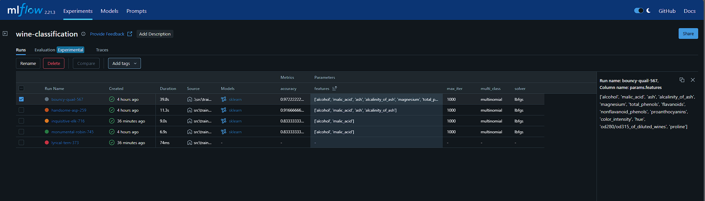
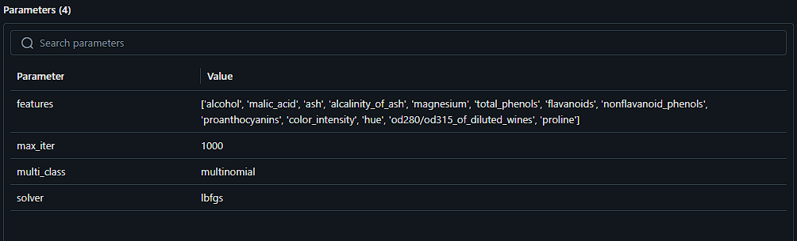
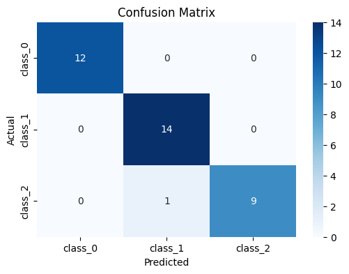

# Projeto: Classificação de Vinhos com MLflow

Este projeto tem como objetivo praticar o uso do **MLflow** em um problema simples de machine learning. A base de dados utilizada é a clássica `Wine Dataset`, que contém características químicas de diferentes tipos de vinhos. O objetivo do modelo é classificar o tipo de vinho com base em suas características químicas.

# Estrutura do Projeto
<pre><code>"""
wine-mlflow-classification/
├── data/
│   └── raw/
│       └── wine.csv                # Base de dados original
├── notebooks/
│   ├── 01_exploration.ipynb        # Análise exploratória
│   └── 02_modeling.ipynb           # Primeiro Treinamento 
├── src/
│   └── train_model.py              # Script para treino e testes de features com mlflow
├── .env.example                    # Exemplo de variáveis de ambiente
├── .gitignore                      # Arquivos a serem ignorados pelo Git
├── config.yml                      # Configurações de features e descrição
├── requirements.txt                # Dependências do projeto
├── README.md                       # Este arquivo"""
</code></pre>

# Tecnologias Utilizadas
    - Python Python 3.12.9

    - Pandas, NumPy
  
    - Scikit-learn
  
    - Seaborn, Matplotlib
  
    - MLflow
  
    - dotenv (para variáveis de ambiente)

# Como Rodar o Projeto

- Após setup do ambiente, basta executar *src/train_model.py*

- Para testes de features para treino, alterar no *config.yml*

- Acompanhe os experimentos com MLflow
  
## Experimentações

## Melhor modelo experimentado: 

#### acc: 0.9722222222222222

